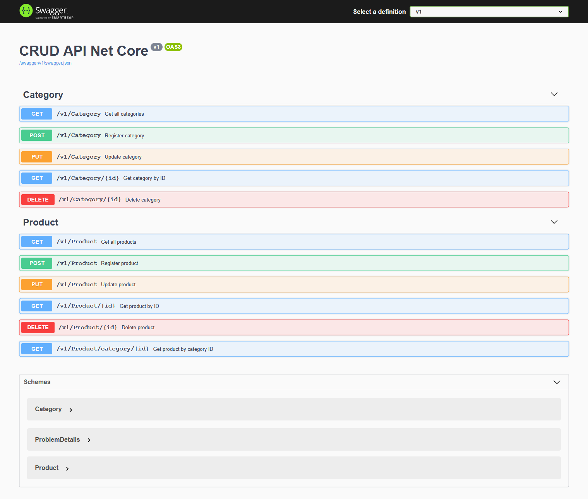

<h1 align="center">
💡   CRUD API NET CORE 3.0 </h1>

>
”Viva para ser feliz e não viva em vão.” - CBJR

# Visual Studio
Open the solution file <code>crud-api-netcore.sln</code>and press the <code>F5</code> key to build and start the project.

# Visual Studio Code
Click on the folder<code>crud-asp-net-core</code> then press the <code>F5</code> key to build and start the project.

# Swagger Enabled
To test the API, just run the project and use the Swagger UI.

The API includes the following features:

### Products
GET `/v1/Product` Get all products

GET `/v1/Product/{id}` Get product by ID

GET `/v1/Product/category​/{id}` Get product by category ID

POST `/v1/Product` Register product

PUT `/v1/Product` Update product

DELETE `/v1/Product/{id}` Delete product

### Categories
-GET `/v1/Category` Get all categories

-POST `/v1/Category` Register category

-PUT `/v1/Category` Update category

-GET `/v1/Category​/{id}` Get category by ID

-DELETE `/v1/Category​/{id}` Delete category

